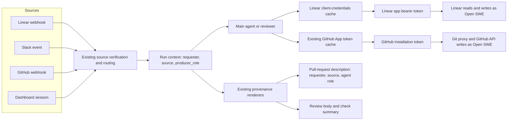
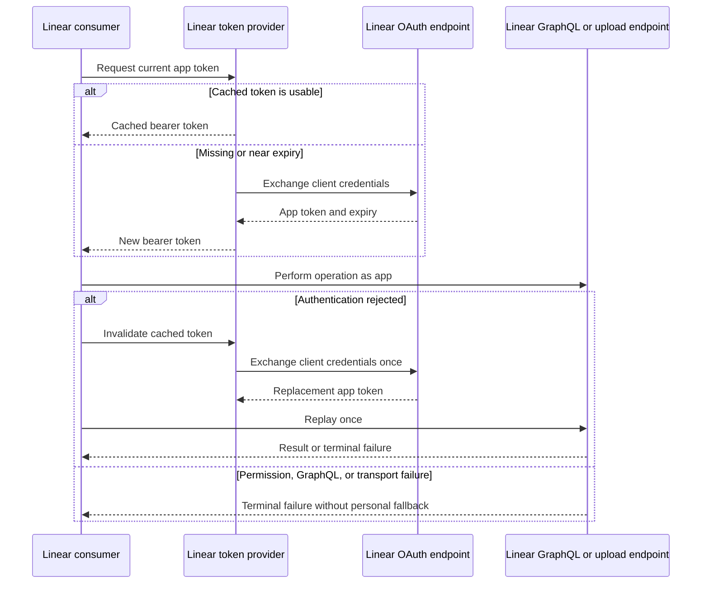

# Open SWE Service Identity - Plan

## Goal Capsule

- **Objective:** Make Open SWE the authenticated platform actor and primary author for work it performs in Linear and GitHub while preserving requester and producer-role provenance.
- **Product authority:** The Product Contract owns identity, authorization, attribution, and failure behavior. Planning may choose implementation details but may not add native Linear agent interaction, per-role platform identities, or personal execution credentials.
- **Planning authority:** Extend the existing Linear client, GitHub App token resolver, run metadata, and publication helpers. Do not introduce a generalized credential or identity framework.
- **Execution profile:** Implement the five dependency-ordered units below, with focused characterization coverage before changing current identity behavior.
- **Stop conditions:** Stop if Linear client credentials cannot produce the installed app actor, the GitHub App lacks a required write permission, or the configured Git identity cannot be verified as the Open SWE bot account. Do not restore personal credentials to proceed.
- **Tail ownership:** The executor owns implementation, targeted and full verification, the live cutover checks, and the Open SWE-authored pull request.

---

## Product Contract

### Summary

Open SWE will use one deployment-owned service identity across Linear and GitHub, implemented through the existing platform clients and publishing surfaces. Requester and producer-role provenance will appear in current pull-request and review artifacts without a new dashboard, role registry, credential store, or background token service.

**Product Contract preservation:** Product Contract unchanged.

### Problem Frame

Open SWE currently authenticates every Linear read and mutation with one all-access personal API key, so Linear attributes its actions to the person who created that key. GitHub execution similarly prefers the triggering person's authorization and authorship, while `open-swe[bot]` receives secondary credit.

That arrangement makes the person appear to have performed work that Open SWE performed. It also couples execution continuity to personal credentials and obscures which internal Open SWE role produced a review or implementation result.

### Key Decisions

- **Open SWE is the platform principal and primary author** (session-settled: user-directed — chosen over human authorship with Open SWE as co-author: authorship should identify who performed the work). Governs R1, R4, R5.
- **Configured source access authorizes execution** (session-settled: user-directed — chosen over per-user GitHub execution authorization: configured integrations and app installation scopes are the intended trust boundary). Governs R2, R3.
- **Requester and producer role are provenance, not authorship** (session-settled: user-approved — chosen over automatic human co-authorship and per-role platform identities: requesting work is not code authorship, and internal roles do not need separate principals). Governs R6, R7.
- **Linear uses deployment-configured client credentials** (session-settled: user-approved — chosen over a pasted token or dashboard-managed OAuth installation: this preserves the current single-workspace topology without manual token rotation). Governs R8, R9.
- **Identity failures stop work** (session-settled: user-directed — chosen over personal-credential fallback: the identity guarantee must not silently regress during an outage or permission failure). Governs R10.

### Actors

- A1. **Open SWE service identity:** Owns platform credentials and performs Linear mutations and GitHub writes.
- A2. **Requester:** Initiates a run through a configured source and remains visible as the person who requested the work.
- A3. **Deployment operator:** Configures source integrations, application credentials, and the Linear team and GitHub repository scopes available to Open SWE.
- A4. **Producer role:** The internal Open SWE capability that produced an artifact, such as the coding agent, default reviewer, or adversarial reviewer.

### Requirements

#### Identity and authorization

- R1. Every Linear mutation and GitHub write performed by Open SWE must authenticate as the Open SWE service identity rather than the triggering human.
- R2. A valid request from any configured Linear, Slack, GitHub, or dashboard source may initiate work within the Linear team access and GitHub repository access granted to Open SWE.
- R3. Per-user GitHub OAuth must remain available for dashboard login and personal settings but must not participate in execution credential selection.
- R4. Open SWE must be the Git author and committer, branch-push actor, and pull-request opener for implementation work it performs.
- R5. Linear comments, issues, and workflow changes made by Open SWE must be attributed to the installed Open SWE app actor.

#### Provenance

- R6. Published implementation work must identify the requesting human and originating source without automatically crediting that person as a code co-author.
- R7. Published work must identify the producer role whenever Open SWE distinguishes that role at runtime, while retaining the single Open SWE platform identity.

#### Credential lifecycle and failure behavior

- R8. Each deployment must use one Linear application identity for its configured workspace, authenticated with operator-supplied client credentials.
- R9. Open SWE must obtain and renew Linear app-actor access without requiring operators to paste or rotate access tokens manually.
- R10. Missing, expired, revoked, or insufficient Open SWE credentials must stop the affected write without falling back to a personal credential.

#### Compatibility and cutover

- R11. Existing source verification, `@openswe` triggering, bot-loop prevention, and repository routing behavior must remain unchanged except where identity-specific behavior requires adaptation.
- R12. The service-identity guarantee must apply to every write after deployment, including writes from threads created before the cutover.

### Key Flows

- F1. **Configure the service identity**
  - **Trigger:** A3 enables Linear or GitHub for a deployment.
  - **Actors:** A1, A3.
  - **Steps:** The operator configures the platform application credentials and limits the teams or repositories available to Open SWE. Open SWE verifies that it can act as its own platform principal.
  - **Outcome:** The deployment is ready to accept work without a personal execution credential.
  - **Covered by:** R1, R2, R5, R8, R9.
- F2. **Perform requested work**
  - **Trigger:** A2 sends a valid request through a configured source.
  - **Actors:** A1, A2, A4.
  - **Steps:** Open SWE verifies the source, resolves the target repository, performs platform writes as A1, and attaches A2 and A4 as provenance.
  - **Outcome:** The resulting Linear and GitHub records identify Open SWE as the actor and preserve who requested and produced the work.
  - **Covered by:** R1-R7, R11.
- F3. **Reject an identity failure**
  - **Trigger:** A1 cannot obtain an app token or lacks permission for the requested write.
  - **Actors:** A1, A2.
  - **Steps:** Open SWE stops the affected operation and its dependent steps, returns the failure to the run, and reports it through an independently authenticated source channel when one exists.
  - **Outcome:** Earlier successful writes remain intact, and no new platform record is created under a misleading human identity.
  - **Covered by:** R10.
- F4. **Continue an existing thread after cutover**
  - **Trigger:** A2 resumes a thread created before service identity was deployed.
  - **Actors:** A1, A2, A4.
  - **Steps:** Open SWE preserves the thread and platform history but resolves current service credentials and reapplies the Open SWE Git identity before any new write.
  - **Outcome:** Historical human-attributed entries remain intact and new entries show the service-identity boundary.
  - **Covered by:** R6, R7, R12.

### Acceptance Examples

- AE1. **Linear attribution**
  - **Covers R1, R5, R6.**
  - **Given:** Eric posts a valid `@openswe` request on a configured Linear issue.
  - **When:** Open SWE acknowledges the request and later updates the issue.
  - **Then:** Linear attributes both mutations to the Open SWE app, while the resulting work retains Eric as the requester.
- AE2. **GitHub implementation attribution**
  - **Covers R1, R4, R6, R7.**
  - **Given:** A valid request causes Open SWE to implement a change.
  - **When:** Open SWE commits, pushes, and opens a pull request.
  - **Then:** `open-swe[bot]` is the commit and pull-request author, the pull request records the requester, source, and coding-agent producer role, and no requester co-author credit is added automatically.
- AE3. **Role provenance**
  - **Covers R7.**
  - **Given:** The adversarial reviewer produces a pull-request review.
  - **When:** Open SWE publishes the review.
  - **Then:** GitHub shows the Open SWE platform identity and the published review identifies the adversarial reviewer as its producer role.
- AE4. **No personal execution authorization**
  - **Covers R2, R3.**
  - **Given:** A request arrives from a configured source and no usable GitHub execution token exists for the requester.
  - **When:** The target repository is within the Open SWE GitHub App installation scope.
  - **Then:** Open SWE may perform the work with its service identity without asking the requester to authorize GitHub execution.
- AE5. **Fail-closed credentials**
  - **Covers R10.**
  - **Given:** Open SWE's Linear or GitHub application credential is revoked or lacks permission.
  - **When:** A run attempts an affected write.
  - **Then:** The write does not occur, the run reports the connection or permission problem, and no human credential is used.
- AE6. **Cutover on a resumed thread**
  - **Covers R12.**
  - **Given:** A thread contains entries previously attributed to a human.
  - **When:** The thread resumes after service identity is deployed.
  - **Then:** Existing history is unchanged and every new Open SWE write uses the service identity.

### Scope Boundaries

- Native Linear agent mentionability, delegation, Agent Sessions, Agent Activities, and Agent Plans are excluded.
- Dashboard-managed Linear installation, multi-workspace credential routing, and per-user Linear authorization are excluded.
- Separate Linear or GitHub identities for the default reviewer, adversarial reviewer, or other internal roles are excluded.
- A generalized persona registry, role-specific credentials, custom role icons, and role-specific platform permissions are excluded.
- Personal GitHub credentials are excluded from commits, pushes, pull-request creation, Linear mutations, and fallback execution.
- Direct actions a signed-in human explicitly performs through the dashboard, such as posting their own review comment, remain human-authored and are not Open SWE execution.
- Historical platform records and pre-cutover pull-request authors are not rewritten.
- Broader cleanup of legacy authentication, dashboard identity, or reviewer architecture is excluded unless removal is required to eliminate an active personal-execution path.

### Dependencies and Assumptions

- Linear client credentials continue to produce an `app` actor token for the installed Open SWE application.
- The deployment operator enables client credentials, grants `read,write`, and limits the app user's team access in the Linear workspace.
- The Open SWE GitHub App is installed on every target repository with the existing write permissions required for Git contents, pull requests, reviews, issues, and checks.
- The configured Open SWE Git name and email resolve to the installed bot account; this is a rollout gate because Git authentication does not set commit-object authorship.
- Signature or session verification on each configured source, plus existing repository and sender policies, is sufficient authorization to exercise Open SWE's installation-scoped permissions.
- One Linear workspace per Open SWE deployment is sufficient for this work.

### Sources and Research

- Linear Developers, [OAuth 2.0 authentication](https://linear.app/developers/oauth-2-0-authentication), [OAuth actor authorization](https://linear.app/developers/oauth-actor-authorization), and [Webhooks](https://linear.app/developers/webhooks).
- Linear Developers, [Agents: Getting Started](https://linear.app/developers/agents) and [Developing the Agent Interaction](https://linear.app/developers/agent-interaction), used to confirm which native agent features remain outside scope.
- GitHub Docs, [Authenticating as a GitHub App installation](https://docs.github.com/en/apps/creating-github-apps/authenticating-with-a-github-app/authenticating-as-a-github-app-installation), [Create a pull request](https://docs.github.com/en/rest/pulls/pulls#create-a-pull-request), [Create a review](https://docs.github.com/en/rest/pulls/reviews#create-a-review-for-a-pull-request), and [Checks API](https://docs.github.com/en/rest/guides/using-the-rest-api-to-interact-with-checks).
- Current Linear seams: `agent/utils/linear.py`, `agent/utils/multimodal.py`, `agent/webhooks/linear_routes.py`, and `agent/webhooks/common.py`.
- Current GitHub authentication and attribution: `agent/utils/github_app.py`, `agent/utils/auth.py`, `agent/utils/authorship.py`, `agent/tools/open_pull_request.py`, `agent/prompt.py`, and `agent/server.py`.
- Current reviewer routing and publication: `agent/webhooks/common.py`, `agent/review/findings.py`, `agent/review/publish.py`, `agent/tools/publish_review.py`, and `agent/utils/github_checks.py`.

---

## Planning Contract

### Key Technical Decisions

- KTD1. **Keep Linear OAuth inside the existing Linear client.** Add one deployment-scoped, in-process client-credentials token cache to `agent/utils/linear.py`, then make every current Linear API and authenticated-upload consumer obtain its bearer token through that seam. Request `read,write`, cache from `expires_in` with expiry skew, reacquire on known expiry, and perform one token replacement plus one replay after an authentication rejection. Do not replay ambiguous mutation transport failures. (session-settled: user-approved — chosen over persistent token storage and background refresh: the platform's 30-day app token can be renewed safely at request time.) Implements R5, R8-R10.
- KTD2. **Use the existing GitHub App resolver for every runtime write.** Make execution-token resolution unconditional on the triggering user, remove independent user-token choices in pull-request and webhook helpers, and remove personal-token admission from Slack, dashboard run start, and schedules. Keep mappings for requester/profile enrichment, and keep all source signature, session, sender-policy, bot-loop, installation-scope, ownership, and repository-routing gates. Implements R1-R3, R10-R12.
- KTD3. **Make bot authorship fixed and requester provenance presentational.** Configure the Open SWE Git identity globally, configure a known existing repository locally during run preparation, and keep the post-clone local configuration for a new checkout. Remove human authorship and automatic co-author instructions, then adapt the existing pull-request footer to show requester, source, and the `agent` producer role alongside the Open SWE/run link. A missing requester field omits only that part of the footer; it never changes the platform principal. (session-settled: user-approved — chosen over a new provenance UI or ledger: the existing pull-request description is the canonical implementation artifact.) Implements R4, R6-R7, R12.
- KTD4. **Store the actual dispatched reviewer graph as a literal producer role.** After reviewer routing resolves, carry `reviewer` or `reviewer_adversarial` in run configuration and reviewer-thread metadata. Render a human-readable label from that value in the existing review body and check summary. The field never selects credentials, permissions, routing, or platform identity. (session-settled: user-approved — chosen over separate agent identities and a role registry: one string preserves provenance without another principal system.) Implements R7.
- KTD5. **Cut over on write without migrating history.** Every new run and resumed run resolves current service credentials, refreshes the sandbox proxy, and reapplies bot Git identity before work. Existing Linear records and human-opened pull requests retain their historical authors; new edits, comments, commits, pushes, reviews, and checks use Open SWE. Implements R11-R12.
- KTD6. **Fail the affected operation, not the distributed history.** An identity or permission error stops dependent work, returns a structured failure, and uses an independently authenticated source channel when available. Earlier successful cross-platform writes are preserved; no rollback coordinator or new health surface is added. Implements R10.
- KTD7. **Reject machinery without a current requirement.** Keep changes within platform-specific clients, the existing auth resolver, run metadata, and publication helpers. Add no dependency, generalized credential provider, identity service, persistent token store, background worker, workspace router, role registry, dashboard installation flow, or thread migration. (session-settled: user-directed — chosen over generalized identity and credential machinery: the user requires the smallest solution that satisfies R1-R12.)

### Implementation Constraints

- Every new abstraction must either remove an existing duplicate identity path or satisfy a cited requirement.
- `agent/utils/linear.py` owns the only new token cache. GitHub continues to use `agent/utils/github_app.py`.
- Personal OAuth data may remain stored for dashboard sessions and settings, but execution code must not read it to choose a token.
- `producer_role` is an informational string on existing configuration and metadata. It is not a domain model or registry.
- Delete identity-specific dead code only when the active path no longer uses it. Do not broaden the change into a dashboard, webhook, or reviewer refactor.
- Use the existing async-only conventions. Do not add sync/async dual implementations.

### High-Level Technical Design

The component boundary keeps source authorization, execution identity, and provenance separate:

Linear renewal is request-driven and bounded:

### Sequencing

1. Establish the Linear app-actor seam so the personal API key can be removed without leaving secondary consumers behind.
2. Make GitHub execution service-only and remove the personal-token admission gates.
3. Change commit and pull-request attribution after the runtime token principal is fixed.
4. Add producer-role provenance on top of the single GitHub App identity.
5. Update operator documentation and prove the forward-only cutover on live disposable records.

### System-Wide Impact

- **Authentication and authorization:** Source verification remains the request boundary; Linear team access and GitHub installation scope become the execution boundary. A mapped personal account no longer grants or withholds execution rights.
- **Dashboard:** GitHub OAuth sessions, profiles, personal settings, and explicit human-authored actions remain intact. Agent runs and schedules stop consulting the OAuth-token store for execution admission or credentials.
- **Sandboxes:** Reused sandboxes receive a fresh GitHub App proxy token and both global and repository-local bot Git identity before writes.
- **Linear:** Tools, webhook enrichment, reactions, completion comments, and authenticated attachments share one app token and one failure policy.
- **GitHub:** Open SWE execution-time commits, pushes, pull requests, comments, reviews, and checks use the installation token. Direct actions a signed-in human explicitly performs through the dashboard remain human-authored. Requester and producer-role metadata remain presentation only.
- **Operators:** Deployment configuration replaces the personal Linear key with app client credentials and requires a one-time bot identity and permission smoke check.

### Risks and Mitigations

- **The configured Git email may not map to the GitHub bot account.** Keep the existing configured identity rather than inventing a noreply formula, and make live commit attribution a rollout gate.
- **A required Linear team or GitHub repository may be outside the app's scope.** Verify the intended team/repository and exact permissions before cutover; treat denial as a terminal configuration error.
- **A cross-platform run may partially succeed before a later write fails.** Preserve successful writes, stop dependent work, and report the exact failed boundary; do not add distributed rollback.
- **A secondary identity path may survive outside the main resolver.** Characterize and invert pull-request creation, Slack admission, GitHub email-mapping gates, webhook reactions, and resumed-thread caches before removing legacy behavior.
- **Provider errors may expose credentials.** Return configuration-safe error categories, redact recognizable client-secret and token values from tool results and logs, and test both output channels without adding a new logging system.
- **The new Linear app actor may bypass the old bot-loop shape.** Exercise a representative app-authored webhook payload and prove acknowledgement and completion comments do not dispatch another run.
- **Linear or GitHub may change token representation.** Treat access tokens as opaque and rely only on documented expiry and response behavior.
- **A provenance formatter may become a role framework.** Keep the accepted values bounded to current graph IDs and the output limited to the existing pull-request, review, and check surfaces.

### Documentation and Operational Notes

- Replace the personal Linear API-key setup in `docs/INSTALLATION.md` with OAuth app creation, client-credentials enablement, `read,write` scope, team access, and deployment client ID/secret configuration.
- Document the GitHub App permissions required by the existing write surfaces and state that dashboard OAuth is not an execution prerequisite.
- Document a disposable staging acceptance pass covering the Linear actor, Git commit/PR actor, reviewer actor plus role label, denied permission, and resumed-thread cutover.
- Do not add a credential status page, installation wizard, periodic refresh task, or historical migration procedure.

---

## Implementation Units

### U1. Replace the personal Linear key with the app-actor token seam

**Goal:** Route every outbound Linear request through one request-time client-credentials token cache.

**Requirements:** R1, R5, R8-R12; F1, F3, F4; AE1, AE5, AE6; KTD1, KTD6, KTD7.

**Dependencies:** None.

**Files:**

- `agent/utils/linear.py`
- `agent/utils/multimodal.py`
- `agent/webhooks/common.py`
- `tests/tools/test_linear_auth.py`
- `tests/webhooks/test_linear_routes.py`
- `tests/agent/test_multimodal.py`

**Approach:**

1. Replace the module-level personal key header with an async app-token provider colocated with the existing GraphQL client.
2. Make the provider request the documented app actor and keep only its token and expiry in process.
3. Route webhook issue reads, reactions, and Linear attachment authorization through the same provider instead of reading environment credentials directly.
4. Bound token replacement and replay by KTD1, preserving safe redirect-host checks for attachments and existing GraphQL result shapes for tools.
5. Return a distinguishable credential or permission failure without exposing secrets or falling back to `LINEAR_API_KEY`.

**Execution note:** Add characterization tests for all three current Linear credential consumers before removing the personal-key path.

**Patterns to follow:** The expiry-aware in-process cache and test reset hook in `agent/utils/github_app.py`; the async HTTP and error-shaping conventions already present in `agent/utils/linear.py`.

**Test scenarios:**

- A valid client ID and secret mint an app token with `read,write`, and two requests before expiry reuse the cached token.
- A missing credential or token-exchange failure prevents the downstream Linear request and returns a configuration-safe error.
- Recognizable client-secret and access-token values in a provider failure appear in neither the returned error nor captured logs.
- A near-expiry token is replaced before the next request.
- A GraphQL authentication rejection invalidates the cache, mints once, replays once, and returns the replacement request's result.
- A replacement authentication rejection, permission denial, or GraphQL authorization error fails without another replay or personal-key request.
- A mutation transport failure is returned without an automatic replay that could duplicate the write.
- Linear webhook issue fetches and reactions use the app bearer token and preserve their current success/failure return contracts.
- A Linear attachment fetch uses the same app token only while redirects remain on the allowed Linear upload host.
- An app-authored Linear comment webhook is ignored by the bot-loop guard and does not create a second run.
- Covers AE1. A comment and issue update carry the app bearer token rather than a personal API key.
- Covers AE5 / AE6. A revoked cached token on a resumed flow cannot trigger a human-authenticated retry.

**Verification:** All Linear tools, webhook helpers, and Linear upload fetches have one observable token source; repository search finds no runtime `LINEAR_API_KEY` consumer.

### U2. Make GitHub execution service-only across every trigger path

**Goal:** Use the existing GitHub App installation token for every Open SWE execution-time GitHub write while preserving dashboard OAuth for sessions, settings, and direct human-authored actions.

**Requirements:** R1-R3, R10-R12; F2-F4; AE2, AE4-AE6; KTD2, KTD5-KTD7.

**Dependencies:** None.

**Files:**

- `agent/utils/auth.py`
- `agent/tools/open_pull_request.py`
- `agent/webhooks/slack.py`
- `agent/webhooks/github.py`
- `agent/webhooks/common.py`
- `agent/dashboard/thread_api.py`
- `agent/dashboard/schedules.py`
- `tests/auth/test_auth_sources.py`
- `tests/auth/test_github_token_ttl.py`
- `tests/github/test_open_pull_request.py`
- `tests/github/test_github_issue_webhook.py`
- `tests/slack/test_slack_context.py`
- `tests/dashboard/test_dashboard_web_handoff.py`
- `tests/dashboard/test_dashboard_thread_api.py`
- `tests/agent/test_agent_schedules.py`

**Approach:**

1. Make the existing execution resolver return an installation token regardless of requester, source, stored OAuth token, or prior thread cache.
2. Remove the pull-request tool's independent user-token preference and use the same installation-token seam.
3. Remove Slack account-link admission, GitHub email-mapping skips, dashboard run-start token checks, and schedule create/launch token checks that exist only to obtain or validate a personal execution token.
4. Replace webhook-local user-token resolution and retry helpers so issue reactions, pull-request follow-ups, context fetches, and queued runs use the installation-token seam.
5. Retain requester mappings for profile selection and provenance, and retain existing signature, session, sender-policy, installation, bot-loop, allowlist, repository-routing, dashboard ownership, and schedule ownership checks.
6. Accept the current opaque installation-token formats without adding token-shape validation.

**Execution note:** Invert the existing user-token-wins and missing-user-token-blocks tests before deleting the corresponding branches.

**Patterns to follow:** `agent/utils/github_app.py` for minting, scope, expiry, and cache behavior; the reviewer path's existing direct use of an installation token.

**Test scenarios:**

- Linear, Slack, GitHub, dashboard, and scheduled run configurations all resolve an installation token when requester OAuth is present.
- The same configurations resolve an installation token when the requester has no mapping or OAuth record.
- A missing, expired, revoked, or insufficient GitHub App credential fails without consulting the dashboard OAuth store.
- Pull-request creation uses the installation token even when a valid user token exists.
- A Slack mention without an account link proceeds when source verification and repository routing succeed.
- A GitHub issue or pull-request comment from a valid sender proceeds without an email mapping, while existing public-repository sender policy still rejects an unauthorized sender.
- A valid unmapped GitHub issue or pull-request comment uses the app token for its reaction, context fetch, and queued follow-up run.
- Dashboard login and profile handoff continue to retain the authenticated user's login and settings, and a dashboard run starts without an OAuth-token record when the app installation covers the repository.
- Schedule creation and launch do not require a user token, but still enforce schedule ownership and the app installation's repository access.
- A signed-in human's explicit dashboard review comment remains human-authored and does not pass through the Open SWE execution resolver.
- Covers AE4. A configured-source request completes through the app installation with no requester execution authorization.
- Covers AE5 / AE6. A resumed thread carrying a cached user token replaces it with current app credentials before a GitHub write.

**Verification:** Every runtime GitHub writer obtains an installation token, dashboard OAuth tests still pass, and source-routing/security tests show no policy broadening beyond removal of the personal-token prerequisite.

### U3. Make Open SWE the Git author and publish requester provenance

**Goal:** Make Open SWE the author and committer of new work while recording who requested it and through which source.

**Requirements:** R4, R6-R7, R12; F2, F4; AE2, AE6; KTD3, KTD5, KTD7.

**Dependencies:** U2.

**Files:**

- `agent/utils/authorship.py`
- `agent/prompt.py`
- `agent/server.py`
- `tests/auth/test_authorship.py`
- `tests/github/test_github_comment_prompts.py`
- `tests/agent/test_agent_assembly_context.py`
- `tests/sandbox/test_sandbox_recovery.py`

**Approach:**

1. Stop deriving commit identity from the triggering user's token or profile and remove the bot-as-co-author instruction.
2. Render the configured Open SWE bot name and email after a new clone, and make run preparation reset the known active repository's local identity when a checkout already exists.
3. Preserve the current requester and source fields, add `agent` as the implementation producer role in run context, and adapt the existing pull-request attribution footer to render them with the existing Open SWE/run link.
4. Keep provenance idempotent on pull-request updates and omit unavailable requester details without inventing an identity.
5. Preserve historical records and existing pull-request creators while ensuring every new commit and subsequent write uses Open SWE.

**Execution note:** Verify the repository-local override case before treating global Git configuration as sufficient.

**Patterns to follow:** The existing `build_pr_attribution_footer` replacement/idempotency behavior and the sandbox's per-run global identity setup.

**Test scenarios:**

- The system prompt always configures the Open SWE bot name and email even when requester identity and OAuth data are available.
- Commit guidance contains no automatic `Co-authored-by` trailer for the requester or Open SWE.
- The pull-request footer renders a mapped GitHub requester and source with the existing run link.
- The pull-request footer renders the coding-agent producer role without creating a role-specific identity.
- An unmapped Slack or Linear requester uses available source display data without becoming an author or execution principal.
- Reapplying the footer during a pull-request update does not duplicate requester, producer, or run attribution.
- A reused sandbox with a human repository-local identity is reset to Open SWE before the next commit.
- Covers AE2. A new commit and pull request are bot-authored and the requester appears only in the pull-request description.
- Covers AE6. A pre-cutover thread preserves old authorship and uses Open SWE for every new commit and update.

**Verification:** Prompt, authorship-helper, pull-request-body, and sandbox-recovery tests agree on one bot author plus presentational requester provenance.

### U4. Add lightweight producer-role provenance to reviews

**Goal:** Distinguish default and adversarial reviewer output while retaining the single Open SWE GitHub identity.

**Requirements:** R7, R12; F2, F4; AE3, AE6; KTD4, KTD5, KTD7.

**Dependencies:** U2.

**Files:**

- `agent/webhooks/common.py`
- `agent/review/findings.py`
- `agent/review/publish.py`
- `agent/tools/publish_review.py`
- `agent/utils/github_checks.py`
- `tests/webhooks/test_reviewer_routing.py`
- `tests/github/test_github_issue_webhook.py`
- `tests/reviewer/test_reviewer_publish.py`
- `tests/github/test_github_checks.py`

**Approach:**

1. Set `producer_role` from the actual reviewer graph selected after routing and carry it in configurable state and reviewer-thread metadata.
2. Read that value at publication time and render one human-readable role line in the existing review summary and check output.
3. Preserve the existing `kind=reviewer` thread classification, review routing, re-review forcing, finding storage, and one GitHub App token.
4. Use the coding-agent role only where an existing implementation artifact already renders producer provenance; do not add new surfaces.

**Patterns to follow:** `_build_reviewer_configurable` for run context, `set_reviewer_thread_metadata` for durable reviewer metadata, and `render_review_body` plus check-result helpers for host-controlled publication.

**Test scenarios:**

- A default first review stores and publishes the default reviewer role.
- An adversarial first review stores and publishes the adversarial reviewer role.
- A re-review forced from adversarial routing to the default reviewer records the graph that actually ran.
- Missing legacy metadata falls back to the default reviewer label without changing credentials or routing.
- Review body and check summary show the same producer role and remain idempotent on retry.
- Both roles publish through the same installation token and keep `kind=reviewer`.
- Covers AE3. An adversarial review is app-authored and visibly identifies the adversarial reviewer.
- Covers AE6. A resumed reviewer thread uses current service credentials and preserves the role that produced each new publication.

**Verification:** Reviewer dispatch, metadata, review-body, and check tests prove that role affects presentation only.

### U5. Document and prove the forward-only cutover

**Goal:** Give operators the minimum configuration and acceptance procedure needed to deploy the identity boundary safely.

**Requirements:** R5, R8-R12; F1, F3, F4; AE1-AE6; KTD5-KTD7.

**Dependencies:** U1-U4.

**Files:**

- `docs/INSTALLATION.md`

**Approach:**

1. Replace personal Linear key instructions and environment references with client ID and secret configuration, `read,write` scope, app-user team access, and webhook-secret separation.
2. State the GitHub App repository and write-permission prerequisites and the distinction between dashboard login OAuth and runtime execution.
3. Add a disposable staging acceptance checklist for platform actor identity, requester/role provenance, permission denial, and a resumed pre-cutover thread.
4. State the forward-only boundary: historical records are preserved, and rollback restores deployment configuration rather than rewriting platform history.

**Execution note:** Treat the live actor and Git identity checks as rollout gates, not optional observation.

**Patterns to follow:** The existing installation guide's platform-by-platform setup and environment-variable sections.

**Test scenarios:**

- Test expectation: none — this unit changes operator documentation; its behavioral proof is the live acceptance contract below.

**Verification:** A cold-read operator can configure the two app identities and execute every live acceptance check without a personal Linear key or user execution token.

---

## Verification Contract

### Targeted automated gates

- **Linear identity:** `uv run pytest -vvv tests/tools/test_linear_auth.py tests/webhooks/test_linear_routes.py tests/agent/test_multimodal.py`
- **GitHub execution authorization:** `uv run pytest -vvv tests/auth/test_auth_sources.py tests/auth/test_github_token_ttl.py tests/github/test_open_pull_request.py tests/github/test_github_issue_webhook.py tests/slack/test_slack_context.py tests/dashboard/test_dashboard_web_handoff.py tests/dashboard/test_dashboard_thread_api.py tests/agent/test_agent_schedules.py`
- **Authorship and requester provenance:** `uv run pytest -vvv tests/auth/test_authorship.py tests/github/test_github_comment_prompts.py tests/agent/test_agent_assembly_context.py tests/sandbox/test_sandbox_recovery.py`
- **Producer-role provenance:** `uv run pytest -vvv tests/webhooks/test_reviewer_routing.py tests/github/test_github_issue_webhook.py tests/reviewer/test_reviewer_publish.py tests/github/test_github_checks.py`

### Repository quality gates

- `make test`
- `make lint`
- `make typecheck`

### Live acceptance gates

Run against one disposable Linear issue in the configured workspace and one disposable branch/pull request in an installed staging repository:

1. Trigger work from Linear and confirm the acknowledgement plus issue mutation are attributed to the Open SWE app actor.
2. Trigger implementation with a requester OAuth token present, then confirm the commit author, committer, push actor, and pull-request opener are Open SWE while the pull-request description records requester, source, and coding-agent producer role.
3. Publish one default and one adversarial review, then confirm both use the Open SWE GitHub identity while the review and check outputs show their actual producer role.
4. Remove one required Linear scope or GitHub permission in the disposable setup, then confirm the affected operation stops without a personal credential request or fallback write.
5. Submit one otherwise valid request from a sender rejected by the configured source policy and one request targeting a repository outside the configured routing or allowlist; confirm neither creates a run or GitHub write.
6. Let the Linear acknowledgement and completion comments return through the webhook as the app actor; confirm exactly one run exists and no recursive dispatch occurs.
7. Resume a pre-cutover thread with a cached human token and a checkout carrying a human local Git identity, then confirm all new writes and commits use Open SWE while historical records remain unchanged.
8. Re-run existing Linear mention, webhook-signature, repository-routing, GitHub sender-policy, dashboard-login, and schedule-ownership flows to confirm their behavior is unchanged.

Record the Linear and GitHub artifact links in the implementation pull request so reviewers can inspect the resulting actors and provenance.

---

## Definition of Done

### Global completion

- Every active runtime Linear consumer uses the client-credentials app token, and `LINEAR_API_KEY` is absent from runtime code and operator instructions.
- Every Open SWE execution-time GitHub writer uses a GitHub App installation token regardless of requester mapping or OAuth state; explicit human-authored dashboard actions remain outside that resolver.
- Dashboard GitHub OAuth still supports login, profiles, and personal settings without influencing execution credentials.
- New commits, pushes, and pull requests identify Open SWE as the actor, while pull-request descriptions identify requester, source, and coding-agent producer role without a co-author trailer.
- Default and adversarial reviews share one platform identity and publish distinct producer-role provenance.
- Missing, revoked, expired, or insufficient app credentials fail closed without personal fallback or unsafe mutation replay.
- Credential failures expose neither client secrets nor access tokens in tool results, logs, or source-channel messages.
- Resumed threads and reused sandboxes honor the post-cutover identity boundary without rewriting history.
- Existing source verification, sender policies, bot-loop prevention, and repository routing remain green.
- Targeted tests, the full suite, lint, type checking, and all live acceptance gates pass.
- Installation documentation reflects the deployed configuration and contains no personal Linear-key setup.
- The final diff contains no generalized credential framework, role registry, background refresh worker, persistent token store, dashboard installation flow, or abandoned experimental code.

### Unit completion

- **U1:** All Linear API and authenticated-upload consumers share the app-token seam and its bounded renewal policy.
- **U2:** All trigger sources reach GitHub through the installation token without user-token admission.
- **U3:** Bot Git authorship and requester/source/coding-agent pull-request provenance agree across prompts, helpers, and reused sandboxes.
- **U4:** Reviewer graph selection persists and renders one presentation-only producer role.
- **U5:** Operators can configure, validate, cut over, and diagnose the service identity using the installation guide.
